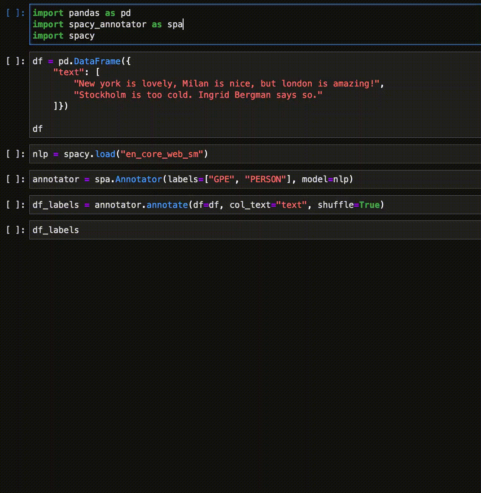

# spacy-annotator

SpaCy annotator for Named Entity Recognition (NER) using ipywidgets.
The annotator allows users to quickly assign (custom) labels to one or more entities in the text.   

**Features**:

* The annotator supports pandas dataframe (see `pandas_annotations.py`): it adds annotations in a separate 'annotation' column of the dataframe;
* If a spaCy model is passed into the annotator, the model is used to identify entities in text.   
This trick of pre-labelling the example using the current best model available allows for accelerated labelling - also known as of noisy pre-labelling;
* The annotations adhere to spaCy format and are ready to serve as input to a spaCy NER model.   
No additional code required!

~Note: not using pandas dataframe? No problem. You can always label entities from text stored in a simple python list.~

Blog post: [medium/enrico.alemani/spacy-annotator](https://medium.com/@enrico.alemani/how-to-create-training-data-for-spacy-ner-models-using-ipywidgets-c4aa71bf61a2)

## Example 

For code, see [spacy_annotator demo](demo/spacy_annotator_demo.ipynb) notebook.

## Contributors
[dayalstrub-cma](https://github.com/ieriii/spacy-annotator/tree/annotator-v2) - Refactored code to class, added displacy visualisation and entity ruler.

## Contributing

1. Fork the repo on GitHub;
2. Clone the project to your own machine;
3. Commit changes to your own branch; and
4. Push your work back up to your own fork;
5. Submit a Pull request so that I can review your changes.

## Dependencies

Spacy-annotator works with SpaCy 3.X, and ipywidgets 7.X.

## References

spacy-annotator is based on [spaCy](https://spacy.io/) and [pigeon](https://github.com/agermanidis/pigeon) (see also [PigeonXT](https://github.com/dennisbakhuis/pigeonXT)).   
Many thanks to them for making their awesome libraries publicly available. Another interesting project is [Doccano](https://github.com/doccano/doccano).

**Note**:
spaCy is a great library and, most importantly, free to use. So please also consider using the https://prodi.gy/ annotator to keep supporting the spaCy deveopment.
