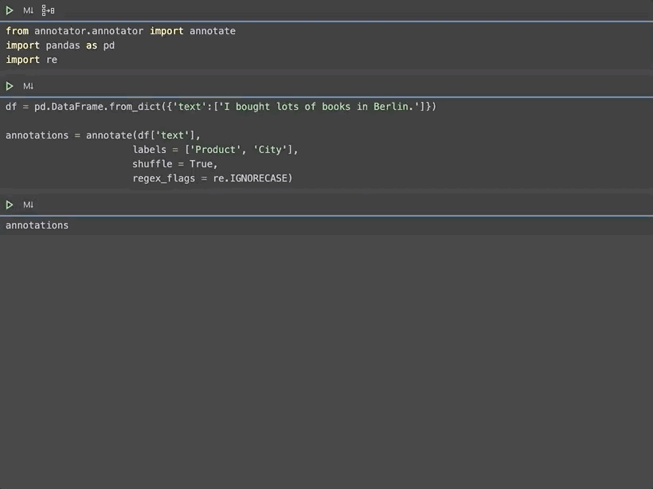

# spacy-annotator
SpaCy annotator for named entity recognition (NER) using ipywidgets

## Example code
```python
from annotator.annotator import annotate
import pandas as pd
import re

df = pd.DataFrame.from_dict({'text':['I bought lots of books in Berlin.']})

annotations = annotate(df['text'],
                      labels = ['Product', 'City'],
                      shuffle = True,
                      regex_flags = re.IGNORECASE)

print(annotations)
```

## Preview


## Contributing
1. Fork the repo on GitHub
2. CLone the project to your own machine
3. Commit changes to your own branch
4. Push your own work back up to your fork
5. Submit a Pull request so that I can review your changes

## Credits
spacy-annotator is based on [SpaCy](https://spacy.io/) and [pigeon](https://github.com/agermanidis/pigeon).   
Many thanks to them for making their awesome library publicly available.
